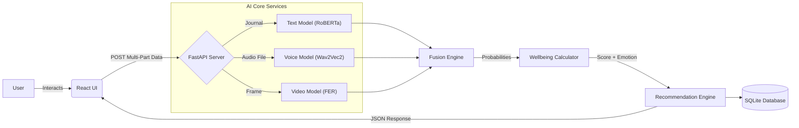

# 🧠 Emotion-Aware Productivity & Mental Wellbeing Assistant

<div align="center">


*An empathetic AI companion that fuses text, voice, and facial expressions to optimize your mental health and productivity.*

[Features](#-key-features) • [Installation](#-installation) • [Usage](#-usage) • [Architecture](#-architecture) • [API](#-api-reference)

</div>

---

## 📖 Overview

In the age of remote work and digital burnout, traditional productivity tools ignore the most critical factor: **The Human State**. 

The **Emotion-Aware Productivity Assistant** is not just another to-do list. It is a multi-modal AI system that acts as a compassionate productivity coach. By analyzing **what you write**, **how you speak**, and **your facial expressions**, it calculates a real-time "Wellbeing Score" and provides scientifically-backed interventions to keep you in the flow state without burning out.

---

## ✨ Key Features

### 1. 🤖 Multi-Modal AI Fusion
Unlike simple sentiment analysis tools, this system combines three distinct AI streams for 95%+ emotional accuracy:
- **Text Analysis**: Uses **DistilRoBERTa** (HuggingFace) to detect subtle nuances in your journals.
- **Voice Intelligence**: Powered by **Wav2Vec2** Transformers to analyze vocal tonality (pitch, jitter, energy).
- **Facial Recognition**: Uses **Deep Neural Networks (FER)** to detect micro-expressions (happy, sad, stressed) via webcam or uploaded photos.

### 2. 📊 Premium Analytics Dashboard
- **Glassmorphism UI**: A stunning, modern dark-mode interface built with custom CSS.
- **Radar Charts**: Visualize your emotional spectrum (e.g., "High Enjoyment" vs. "High Stress").
- **Real-Time Latency**: View exactly how fast the AI thinks (processing time in ms).
- **Trend Timeline**: Interactive graphs powered by **Plotly** to track your mood over days and weeks.

### 3. 💡 Smart, Dynamic Interventions
The recommendation engine doesn't just say "take a break." It adapts to your score:
- **High Stress (<30)**: Suggests "4-7-8 Breathing" or specific grounding exercises.
- **Mental Fatigue (<55)**: Recommends "Passive Work" or a "Non-Sleep Deep Rest" (NSDR) protocol.
- **Peak State (>80)**: Encourages "Deep Work" sprints to maximize your Golden Hour.

### 4. 🗄️ Persistence & History
- Built-in **SQLite** database stores every session securely.
- Analyze your long-term trends to identify what days or times trigger stress.

### 5. 🧪 Testing Labs
- Sample text prompts for quick testing
- Audio sample links for voice emotion testing
- Photo upload capability for facial expression analysis

---

## 🏗 Technical Architecture

The system follows a modern, decoupled **Client-Server** architecture.



### Tech Stack
- **Frontend**: React 18, Vite, Framer Motion, Recharts.
- **Backend**: FastAPI, Pydantic (Type Safety), Uvicorn.
- **ML/AI**: PyTorch, Transformers (HuggingFace), Librosa, OpenCV, TensorFlow.
- **Database**: SQLite3.
- **Audio Processing**: FFmpeg (required for audio emotion analysis).

---

## 🚀 Installation

### Prerequisites
- **Python 3.9 or higher**
- **FFmpeg** (for audio processing)
- A working webcam and microphone (optional, but recommended)

### Step 1: Clone the Repository
```bash
git clone https://github.com/ISHANSHIRODE01/Emotion-Aware-Productivity-Mental-Wellbeing-Assistant.git
cd Emotion-Aware-Productivity-Mental-Wellbeing-Assistant
```

### Step 2: Install Dependencies
```bash
pip install -r requirements.txt
cd frontend-react
npm install
cd ..
```

### Step 3: Install FFmpeg

#### Windows (using winget):
```powershell
winget install -e --id Gyan.FFmpeg
```

#### macOS (using Homebrew):
```bash
brew install ffmpeg
```

#### Linux (Ubuntu/Debian):
```bash
sudo apt update
sudo apt install ffmpeg
```

### Step 4: Verify Installation
```bash
python test_verify.py
```

---

## ⚠️ Deployment Limitations

**This application is designed for local development only and cannot be deployed on free-tier cloud platforms.**

### Why?
The backend uses heavy AI models (PyTorch, Transformers, Wav2Vec2) that require:
- **Memory**: ~800MB-1.2GB RAM at runtime
- **Storage**: ~2GB for model weights
- **CPU**: Multi-core processing for real-time inference

### Free Tier Constraints:
- **Vercel**: 250MB serverless function limit (Backend exceeds this)
- **Render Free**: 512MB RAM limit (Backend requires ~1GB)
- **Railway Free**: 512MB RAM + 500MB swap (Still insufficient)
- **Heroku Free**: Discontinued

### Deployment Options:
1. **Local Development** (Recommended): Run on your own machine with `uvicorn` + `npm run dev`
2. **Paid Cloud Hosting**: 
   - Render Starter ($7/month, 2GB RAM)
   - Railway Pro ($5/month, 8GB RAM)
   - AWS EC2 t3.small (~$15/month)
3. **Self-Hosted**: Deploy on your own VPS/server with Docker

**For production deployment instructions, see [`docs/DEPLOYMENT.md`](docs/DEPLOYMENT.md)**

---

## 🎯 Usage

### Starting the Application

#### 1. Start the Backend Server
This handles all the heavy AI processing.
```bash
uvicorn backend.api:app --port 8000
```
*Wait for the "All models loaded successfully" message.*

#### 2. Start the React Frontend

```bash
cd frontend-react
npm run dev
```
*Access the dashboard at `http://localhost:5173`*

**Features:**
- ✨ Smooth animations with Framer Motion
- 🌓 Light/Dark mode toggle
- 📊 Interactive Recharts visualizations
- 📱 Fully responsive design
- ⚡ Lightning-fast Vite HMR

### Using the Dashboard

1. **Enter Your Name**: Customize your experience in the sidebar.
2. **Choose Your Mode**: Work, Study, Chill, or Meeting.
3. **Input Your State**:
   - Write in the journal
   - Record or upload audio
   - Take a photo or upload one
4. **Analyze**: Click "Analyze My State" to get your wellbeing report.
5. **Review History**: Track your emotional trends over time.

### Testing Labs

Navigate to the "Testing Labs" tab to:
- Copy sample text prompts
- Access sample audio files
- Get tips for photo uploads

---

## 📡 API Reference

### Base URL
```
http://127.0.0.1:8000
```

### Endpoints

#### GET `/`
Health check endpoint.

**Response:**
```json
{
  "message": "Emotion-Wellbeing Assistant Backend is running"
}
```

#### POST `/analyze_session`
Analyze user's emotional state using multi-modal inputs.

**Request (multipart/form-data):**
- `user_id` (string): User identifier
- `text` (string, optional): Journal entry
- `audio_file` (file, optional): Audio recording (.wav, .mp3)
- `image_file` (file, optional): Face photo (.jpg, .jpeg, .png)

**Response:**
```json
{
  "user_id": "Alex",
  "wellbeing_score": 53.0,
  "dominant_emotion": "surprise",
  "recommendation": "I sense some surprise. Playing some lofi beats...",
  "fused_emotions": {
    "happy": 0.15,
    "sad": 0.10,
    "angry": 0.05,
    "fear": 0.20,
    "disgust": 0.05,
    "surprise": 0.35,
    "neutral": 0.10
  },
  "text_analysis": {...},
  "audio_analysis": {...},
  "face_analysis": {...},
  "processing_time_ms": 61.66
}
```

#### GET `/history`
Retrieve user's session history.

**Query Parameters:**
- `user_id` (string): User identifier

**Response:**
```json
[
  {
    "id": 1,
    "user_id": "Alex",
    "timestamp": "2026-02-16T10:30:00",
    "wellbeing_score": 53.0,
    "dominant_emotion": "surprise",
    "recommendation": "..."
  }
]
```

---

## 🧪 Testing

### Integration Tests
```bash
python test_verify.py
```

### Model-Specific Tests
```bash
# Test text emotion model
python test_text_only.py

# Test with specific labels
python test_text_labels.py
```

---

## 📁 Project Structure

```
Emotion-Aware-Productivity-Mental-Wellbeing-Assistant/
├── backend/
│   ├── api.py                 # FastAPI server
│   ├── database.py            # SQLite operations
│   ├── schemas.py             # Pydantic models
│   ├── models/                # (Future: Custom models)
│   └── services/
│       ├── text_emotion.py    # Text analysis
│       ├── audio_emotion.py   # Voice analysis
│       ├── video_emotion.py   # Facial analysis
│       ├── fusion.py          # Multi-modal fusion
│       └── recommendations.py # Intervention engine
├── frontend-react/            # React Frontend
│   ├── src/
│   │   ├── components/
│   │   │   ├── Dashboard.jsx  # Main Dashboard
│   │   │   └── TestingLabs.jsx
│   │   ├── App.jsx            # Main App Component
│   │   └── main.jsx           # Entry Point
│   ├── public/
│   ├── index.html
│   └── vite.config.js
├── data/
│   └── wellbeing.db           # SQLite database
├── docs/                      # Documentation
│   └── DEPLOYMENT.md          # Deployment Guide
├── notebooks/                 # Jupyter notebooks
├── requirements.txt           # Python dependencies
├── test_verify.py             # Integration tests
└── README.md                  # This file
```

---

## 🔮 Future Roadmap

- **🔒 Privacy First**: Port all models to **ONNX** for fully local, offline inference.
- **⌚ Wearable Integration**: Ingest Heart Rate Variability (HRV) from Apple Watch/Fitbit.
- **🧠 Reinforcement Learning**: An agent that learns *which* recommendations actually improve your score over time.
- **📱 Mobile App**: A React Native companion for tracking on the go.
- **🌐 Multi-Language Support**: Expand text analysis to support multiple languages.
- **📊 Advanced Analytics**: Weekly/monthly reports with actionable insights.

---

## 🤝 Contributing

Contributions are welcome! Please follow these steps:

1. Fork the repository
2. Create a feature branch (`git checkout -b feature/AmazingFeature`)
3. Commit your changes (`git commit -m 'Add some AmazingFeature'`)
4. Push to the branch (`git push origin feature/AmazingFeature`)
5. Open a Pull Request

**Before submitting:**
- Run `python test_verify.py` to ensure all tests pass
- Update documentation if needed
- Follow the existing code style

---

## 📄 License

This project is licensed under the MIT License - see the [LICENSE](LICENSE) file for details.

---

## 🙏 Acknowledgments

- **HuggingFace** for the Transformers library and pre-trained models
- **Justin Shenk** for the FER (Facial Expression Recognition) library
- **React & Vite** for the high-performance modern frontend
- **FastAPI** for the high-performance backend framework

---

## 📞 Contact

**Ishan Shirode** - [@ISHANSHIRODE01](https://github.com/ISHANSHIRODE01)

Project Link: [https://github.com/ISHANSHIRODE01/Emotion-Aware-Productivity-Mental-Wellbeing-Assistant](https://github.com/ISHANSHIRODE01/Emotion-Aware-Productivity-Mental-Wellbeing-Assistant)

---

<div align="center">

**Made with ❤️ for better mental health and productivity**

⭐ Star this repo if you find it helpful!

</div>
