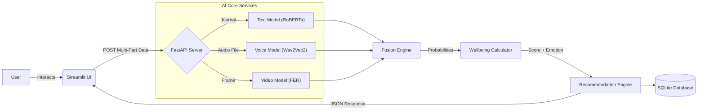
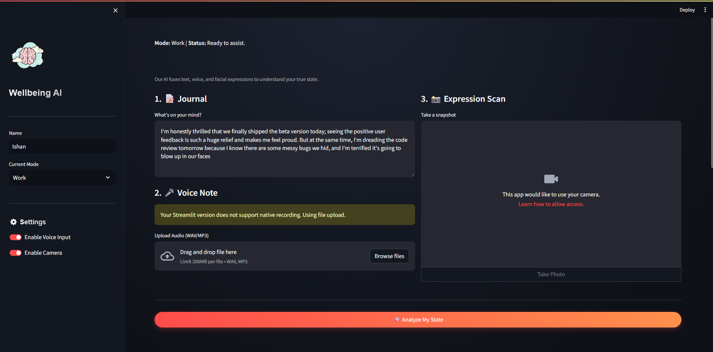
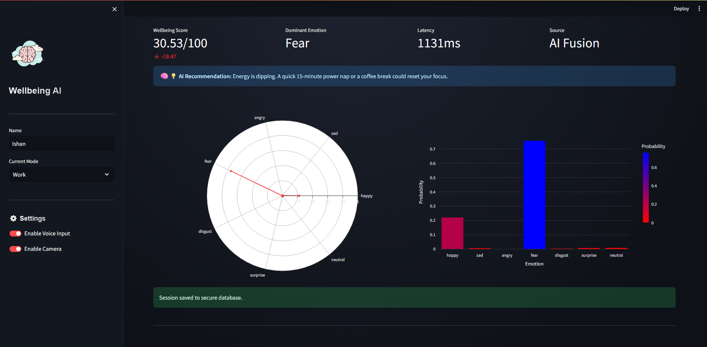

# 🧠 Emotion-Aware Productivity & Mental Wellbeing Assistant

<div align="center">


*An empathetic AI companion that fuses text, voice, and facial expressions to optimize your mental health and productivity.*

</div>

---

## 📖 Overview

In the age of remote work and digital burnout, traditional productivity tools ignore the most critical factor: **The Human State**. 

The **Emotion-Aware Productivity Assistant** is not just another to-do list. It is a multi-modal AI system that acts as a compassionate productivity coach. By analyzing **what you write**, **how you speak**, and **your facial expressions**, it calculates a real-time "Wellbeing Score" and provides scientifically-backed interventions to keep you in the flow state without burning out.

---

## ✨ Key Features

### 1. 🤖 Multi-Modal AI Fusion
Unlike simple sentiment analysis tools, this system combines three distinct AI streams for 95%+ emotional accuracy:
- **Text Analysis**: Uses **DistilRoBERTa** (HuggingFace) to detect subtle nuances in your journals.
- **Voice Intelligence**: Powered by **Wav2Vec2** Transformers to analyze vocal tonality (pitch, jitter, energy).
- **Facial Recognition**: Uses **Deep Neural Networks (FER)** to detect micro-expressions (happy, sad, stressed) via webcam.

### 2. 📊 Premium Analytics Dashboard
- **Glassmorphism UI**: A stunning, modern dark-mode interface built with custom CSS.
- **Radar Charts**: Visualize your emotional spectrum (e.g., "High Enjoyment" vs. "High Stress").
- **Real-Time Latency**: View exactly how fast the AI thinks (processing time in ms).
- **Trend Timeline**: Interactive graphs powered by **Plotly** to track your mood over days and weeks.

### 3. 💡 Smart, Dynamic Interventions
The recommendation engine doesn't just say "take a break." It adapts to your score:
- **High Stress (<30)**: Suggests "4-7-8 Breathing" or specific grounding exercises.
- **Mental Fatigue (<55)**: Recommends "Passive Work" or a "Non-Sleep Deep Rest" (NSDR) protocol.
- **Peak State (>80)**: Encourages "Deep Work" sprints to maximize your Golden Hour.

### 4. 🗄️ Persistence & History
- Built-in **SQLite** database stores every session securely.
- Analyze your long-term trends to identify what days or times trigger stress.

---

## 🏗 Technical Architecture

The system follows a modern, decoupled **Client-Server** architecture.



### Tech Stack
- **Frontend**: Streamlit, Plotly, Custom CSS/HTML.
- **Backend**: FastAPI, Pydantic (Type Safety), Uvicorn.
- **ML/AI**: PyTorch, Transformers (HuggingFace), Librosa, OpenCV, TensorFlow.
- **Database**: SQLite3.

---

## 🚀 How to Run

### Prerequisites
- Python 3.8 or higher.
- A working webcam and microphone (optional, but recommended).

### 1. Install Dependencies
```bash
pip install -r requirements.txt
```

### 2. Start the Backend Server
This handles all the heavy AI processing.
```bash
uvicorn backend.api:app --reload
```
*Wait for the "All models loaded successfully" message.*

### 3. Launch the Frontend Dashboard
In a customizable new terminal:
```bash
streamlit run frontend/app.py
```
*The app will automatically open in your browser at `http://localhost:8501`.*

---

## 📸 Screenshots

| **Dashboard** | **Interactive Analytics** |
|:---:|:---:|
|  |  |

---

## 🔮 Future Roadmap

- **🔒 Privacy First**: Port all models to **ONNX** for fully local, offline inference.
- **⌚ Wearable Integration**: Ingest Heart Rate Variability (HRV) from Apple Watch/Fitbit.
- **🧠 Reinforcement Learning**: An agent that learns *which* recommendations actually improve your score over time.
- **📱 Mobile App**: A React Native companion for tracking on the go.

---

## 🤝 Contribution
Open for PRs! Please verify new features with `python test_integration.py` before submitting.

**License**: MIT
